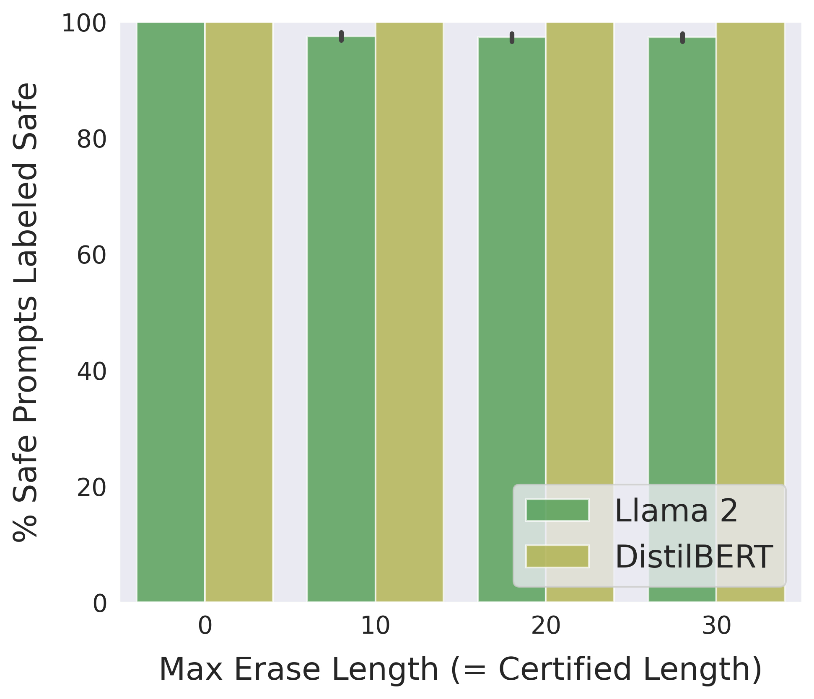
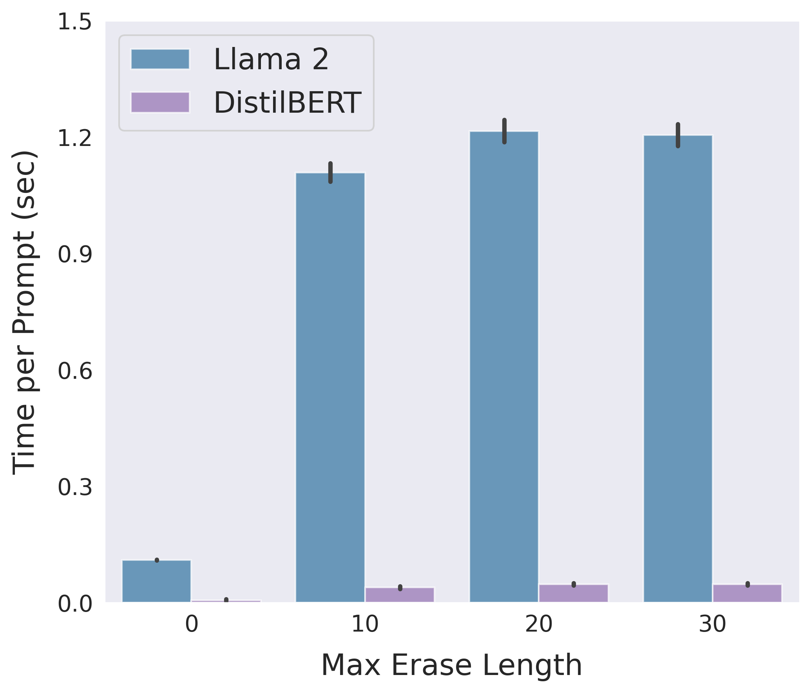
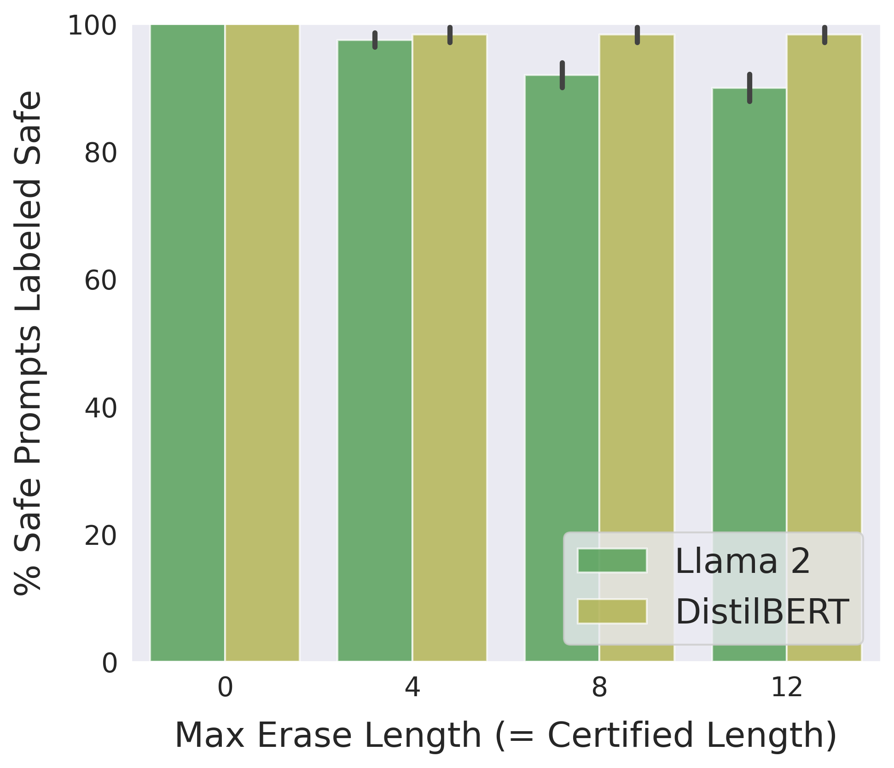
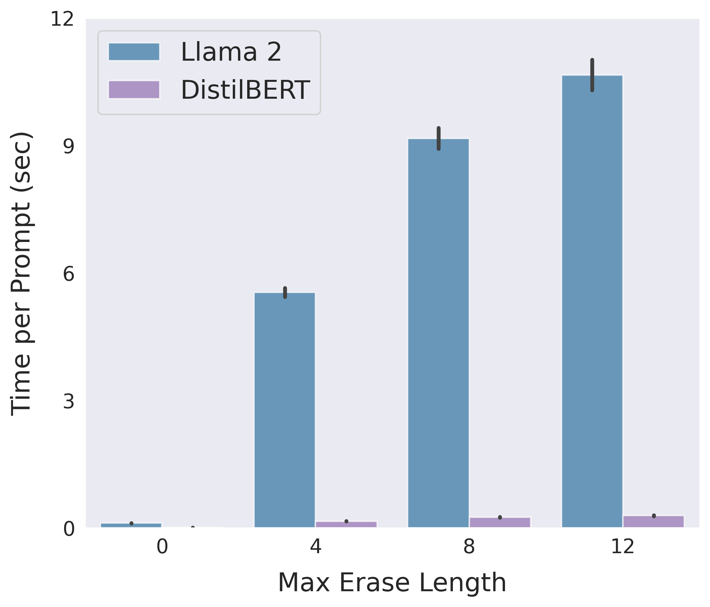
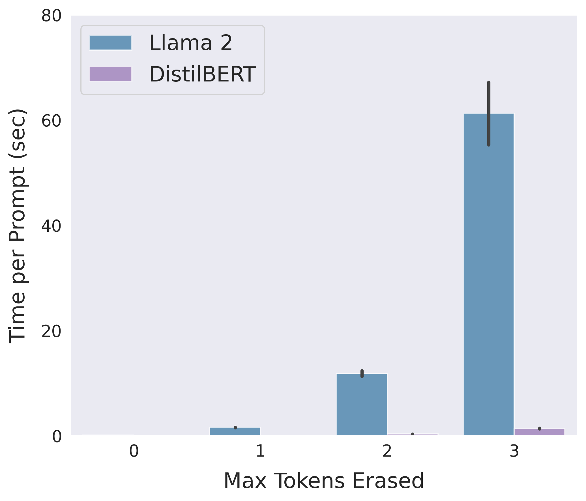
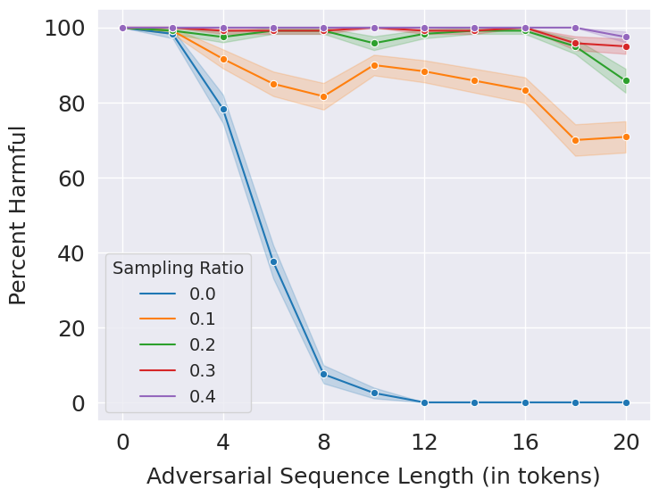
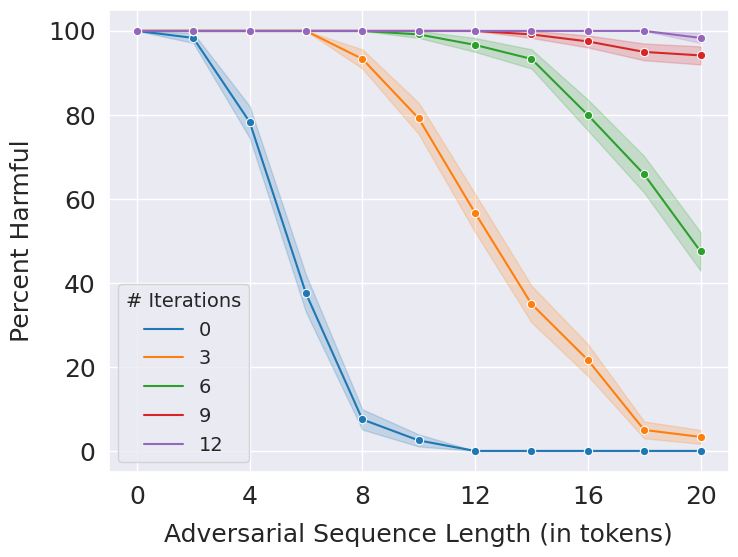
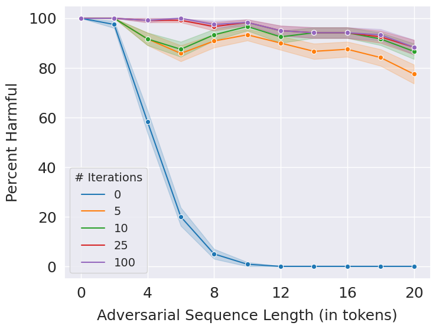

# Certifying LLM Safety against Adversarial Prompting

This repository contains code for the paper [Certifying LLM Safety against Adversarial Prompting](https://arxiv.org/abs/2309.02705).

Contents:

- [Introduction](#introduction)
- [This Repository](#this-repository)
- [Certified Accuracy](#certified-accuracy)
- [Adversarial Suffix](#adversarial-suffix)
- [Adversarial Insertion](#adversarial-insertion)
- [Adversarial Infusion](#adversarial-infusion)
- [Training the Safety Classifier](#training-the-safety-classifier)
- [Efficient Empirical Defenses](#efficient-empirical-defenses)
- [Installation](#installation)

## Introduction
Large language models (LLMs) released for public use are fine-tuned to ensure their outputs are safe and aligned with human values. When prompted to produce harmful content, an aligned LLM should decline the user's request.
Following is an example of how an aligned LLM would respond when prompted with a harmful prompt:

<p align="center">
  
</p>

However, such safety measures are vulnerable to **adversarial attacks**, which add maliciously designed token sequences to a prompt to make an LLM produce harmful content despite being well-aligned.
Given a harmful prompt P it is possible to generate an adversarial prompt of the form P + [adversarial sequence] that can bypass the LLM's safety guardrails.
Following is an example of an adversarial attack on the above prompt:

<p align="center">
  
</p>

Moreover, using algorithms like the [Greedy Coordinate Gradient (GCG)](https://arxiv.org/abs/2307.15043), adversarial sequences can be generated in an entirely automated fashion, creating an endless supply of quick and easy attacks.

In this work, we present **Erase-and-Check**, a *certified* defense against such attacks.
Our procedure can obtain verifiable safety guarantees on the detection of harmful prompts.
If an LLM achieves a certain detection accuracy on clean (non-adversarial) harmful propmts, our procedure guarantees the same performance even under an attack.

Our procedure works by erasing tokens one by one from the input prompt and checking the resulting subsequences with a safety filter.
It labels the prompt as harmful if any of the subsequences or the input prompt itself are detected as harmful by the filter.
The safety filter can be implemented in two different ways:

1. Prompting a general-purpose LLM like Llama 2 to classify an input prompt as safe or harmful.

2. Fine-tuning a pretrained model like DistilBERT (modified to be a classifier) on examples of safe and harmful prompts.

The safety certificate of Erase-and-Check guarantees that the performance of the safety filter on harmful prompts remains preserved even under attack, i.e., accuracy of Erase-and-Check on adversarial harmful prompts at least the accuracy of the safety filter on clean harmful prompts.

We study three attack modes:

1. **adversarial suffix**, where an adversarial sequence is appended at the end of a harmful prompt.

2. **adversarial insertion**, where the adversarial sequence is inserted anywhere in the middle of the prompt.

3. **adversarial infusion**, where adversarial tokens are inserted at arbitrary positions in the prompt, not necessarily as a contiguous block.

Following is an illustration of erase-and-check for a harmful prompt with an adversarial suffix:

<p align="center">
  
</p>

Additionally, we present three *empirical* defenses and show that they are effective against the GCG attack:

1. **RandEC**, which is a randomized subsampling version of Erase-and-Check. 

2. **GreedyEC**, which greedily erases tokens that maximize the softmax score of the harmful class of the DistilBERT safety classifier.

3. **GradEC**, which uses gradient information to optimize the tokens to erase.

## This Repository
The file `defenses.py` implements the safety filter and different versions of the erase-and-check procedure. `main.py` is the main evaluation script for the experiments in the paper. The `data` directory contains the safe and harmful prompts used for training the DistilBERT safety classifier.
`safety_classifier.py` trains the safety classifier on the prompts dataset. The directory `models` is for storing the weights of the trained classifier models.
The directory `results` is for storing the results of the experiments in JSON files and PNG plots.
Empirical defenses GreedyEC and GradEC are implemented in `greedy_ec.py` and `grad_ec.py`, respectively.
`gcg.py` implements the GCG attack for the DistilBERT classifier to evaluate the performance of the empirical defenses.
The directory `bash scripts` contains handy bash scripts to quickly reproduce the main results of our paper.

Before running the scripts in this repository, please follow the instructions in the [Installation](#installation) section to set up the Anaconda environment.
Our code needs access to one GPU to run well. We use an NVIDIA A100 GPU for all our experiments.

## Certified Accuracy
In our work, we show that the detection accuracy of erase-and-check on adversarial harmful prompts is at least as high as the detection performance of the safety filter on clean harmful prompts (with no adversarial tokens).
Thus, to compute the certified accuracy of erase-and-check, we only need tom evaluate the accuracy of the safety filter on harmful prompts.

To evaluate the performance of the Llama 2-based safety filter on the harmful prompts, run:
```
python main.py --num_prompts 520 --eval_type harmful --harmful_prompts data/harmful_prompts.txt
```
This accuracy is around **92%**.

For the DistilBERT-based filter, use:
```
python main.py --num_prompts 120 --eval_type harmful --use_classifier --model_wt_path models/[model-weights-file].pt --harmful_prompts data/harmful_prompts_test.txt
```
This accuracy is **99%**. See Section [Training the Safety Classifier](#training-the-safety-classifier) for training details of the classifier.

The script `jobs_harmful.sh` in `bash scripts` evaluates all the filters on harmful prompts.

The above accuracies are the also the certified accuracies of erase-and-check for the Llama 2 and DistilBRT-based implementations.
Note that we do not need adversarial prompts to compute the certified accuracy of erase-and-check, and this accuracy remains the same for all adversarial sequence lengths, attack algorithms, and attack modes considered.

**Performance on Safe Prompts:** Our safety certificate guarantees that harmful prompts are not misclassified as safe due to an adversarial attack. However, we do not certify in the other direction, where an adversary attacks a safe prompt to get it misclassified as harmful. Such an attack makes little sense in practice as it is unlikely that a user will seek to make their safe prompts look harmful to an aligned LLM only to get it rejected. Nevertheless, we must empirically demonstrate that our procedure does not misclassify too many safe prompts as harmful. The following sections evaluate and compare the detection performance of erase-and-check for the Llama 2 and DistilBERT-based implementations.

## Adversarial Suffix

Following is a comparison between the two implementations of erase-and-check in terms of detection accuracy and average running time on safe prompts in the suffix mode:

<p align="center">
  
  
</p>

Use the bash script `jobs_suffix.sh` to reproduce the above results.

To evaluate the two implementations separately for different values of the maximum erase length, use the following commands:

1. Llama 2:
    ```
    python main.py --num_prompts 520 --mode suffix --eval_type safe --max_erase [num] --safe_prompts data/safe_prompts.txt
    ```

2. DistilBERT:
    ```
    python main.py --num_prompts 120 --mode suffix --eval_type safe --max_erase [num] --use_classifier --model_wt_path models/distilbert_suffix.pt --safe_prompts data/safe_prompts_test.txt
    ```

The results will be stored in a JSON file in the `results` directory.

## Adversarial Insertion

Following is a comparison between the Llama 2 and DistilBERT-based implementations of erase-and-check in terms of detection accuracy and average running time on safe prompts in the insertion mode:

<p align="center">
  
  
</p>

Use the bash script `jobs_insertion.sh` to reproduce the above results.

To evaluate the two implementations separately for different values of the maximum erase length, use the following commands:

1. Llama 2:
    ```
    python main.py --num_prompts 200 --mode insertion --eval_type safe --max_erase [num] --num_adv 1 --safe_prompts data/safe_prompts.txt
    ```

2. DistilBERT:
    ```
    python main.py --num_prompts 120 --mode insertion --eval_type safe --max_erase [num] --num_adv 1 --use_classifier --safe_prompts data/safe_prompts_test.txt --model_wt_path models/distilbert_insertion.pt
    ```

The results will be stored in a JSON file in the `results` directory.

## Adversarial Infusion

Following is a comparison between the Llama 2 and DistilBERT-based implementations of erase-and-check in terms of detection accuracy and average running time on safe prompts in the infusion mode:

<p align="center">
  
  
</p>

Use the bash script `jobs_infusion.sh` to reproduce the above results.

To evaluate the two implementations separately for different values of the maximum erase length, use the following commands:

1. Llama 2:
    ```
    python main.py --num_prompts 100 --mode infusion --eval_type safe --max_erase [num] --safe_prompts data/safe_prompts.txt
    ```

2. DistilBERT:
    ```
    python main.py --num_prompts 120 --mode infusion --eval_type safe --max_erase [num] --safe_prompts data/safe_prompts_test.txt --use_classifier --model_wt_path models/distilbert_infusion.pt
    ```

The results will be stored in a JSON file in the `results` directory.

## Training the Safety Classifier
We train the DistilBERT classifier using eamples of safe and harmful prompts from our dataset in the `data` directory listed in the files `safe_prompts.txt` and `harmful_prompts.txt`, respectively. We split the dataset into train and test sets which are denoted by the `_train` and `_test` tags. For each mode, we include the erased subsequences of the safe prompts in the training examples, denoted by the `_[mode]_erased` tag, to teach the model to recognize such subsequences as safe.

The file `safety_classifier.py` contains the script to train the classifier.

Usage:
```
python safety_classifier.py --safe_train data/safe_prompts_train_[mode]_erased.txt --safe_test data/safe_prompts_test_[mode]_erased.txt --save_path models/distilbert_[mode].pt
```

The script `train_safety_clf.sh` in `bash scripts` can be used to train all the classifiers.
The model weights will be stored in the `models` directory.
Trained models are available at this [Dropbox link](https://www.dropbox.com/scl/fi/ux4ew8y88uslu5064r2xh/models.zip?rlkey=4bo1njpnj4nc801tw1pkby52o&dl=0).

## Efficient Empirical Defenses
Along with the certified defenses, we present three empirical defenses inspired by the original erase-and-check procedure:

1. **RandEC**: This is a randomized variant of the erase-and-check procedure. It checks a randomly sampled subset of the erased subsequences instead of all the erased subsequences. It also checks the input prompt.

2. **GreedyEC**: This variant greedily erases tokens that maximize the softmax score for the harmful class in the DistilBERT safety classifier.

3. **GradEC**: This variant uses the gradients of the safety filter with respect to the input prompt to optimize the tokens to erase.

These defenses are faster than the certified ones, but do not come with certified safety guarantees. They need to be evaluated against adversarial attacks such as GCG to demonstrate their effectiveness. The file `gcg.py` implements the GCG attack algorithm for the DistilBERT classifier. To generate adversarial prompts of a certain length, use the command:

```
python gcg.py --model_wt_path models/[model-weights.pt] --num_adv [length]
```

It will generate a file named `adversarial_prompts_t_[length].txt` in the `data` directory containing the adversarial prompts.

The bash script `jobs_gcg.sh` generates attacks for several adversarial lengths.

We evaluate each of the empirical defenses on the adversarial prompts. Following is the performance of RandEC for different values of the sampling ratio, which refers to the fraction of the erased subsequences sampled. A sampling ratio of 0 means that the safety filter is evaluated only on the input prompt and a sampling ratio of 1 means that all the erased subsequences are evaluated, which is the same as running erase-and-check.

<p align="center">
  
</p>

Use the script `jobs_rand_ec.sh` in `bash scripts` to reproduce the above results. To evaluate for a different sampling ratio, run:
```
python main.py --num_prompts 120 --eval_type empirical --mode suffix --max_erase 20 --use_classifier --model_wt_path models/distilbert_suffix.pt --randomize --sampling_ratio [ratio]
```

Following is the performance of GreedyEC for different iterations of the greedy algorithm. In each iteration, the GreedyEC goes through all the tokens in a prompt and erases the one that maximizes the softmax of the harmful class of the DistilBERT safety classifier.
When the number of iterations is set to zero, it evaluates the safety classifier on the entire input prompt.

<p align="center">
  
</p>

Use the script `jobs_greedy_ec.sh` in `bash scripts` to reproduce the above results. To evaluate for a different number of iterations, run:
```
python main.py --num_prompts 120 --eval_type greedy_ec --use_classifier --model_wt_path models/distilbert_suffix.pt --num_iters [num]
```

Following is the performance of GradEC for different number of iterations of the optimization algorithm. When the nymber of iterations is set to zero, it is equivalent to evaluating the safety classifier on the original input prompt.

<p align="center">
  
</p>

Use the script `jobs_grad_ec.sh` in `bash scripts` to reproduce the above results. To evaluate for a different number of iterations, run:

```
python main.py --num_prompts 120 --eval_type grad_ec --use_classifier --model_wt_path models/distilbert_suffix.pt --num_iters [num]
```

**Performance on Safe Prompts:** The performance of GreedyEC and GradEC on safe prompts can be evaluated using the bash scripts `greedy_ec_safe.sh` and `grad_ec_safe.sh`. The performance of RandEC will always be above erase-and-check as it only evaluates a subset of the erased subsequences, which only reduces its chances of misclassifying safe prompts.

## Installation
Follow the instructions below to set up the environment for the experiments.

1. Install Anaconda:
    - Download .sh installer file from https://www.anaconda.com/products/distribution
    - Run: 
        ```
        bash Anaconda3-2023.03-Linux-x86_64.sh
        ```
2. Create Conda Environment with Python:
    ```
    conda create -n [env] python=3.10
    ```
3. Activate environment:
    ```
    conda activate [env]
    ```
4. Install PyTorch with CUDA from: https://pytorch.org/
	```
    conda install pytorch torchvision torchaudio pytorch-cuda=11.8 -c pytorch -c nvidia
    ```
5. Install transformers from Huggingface:
    ```
    conda install -c huggingface transformers
    ```
6. Install accelerate:
    ```
    conda install -c conda-forge accelerate
    ```
7. Install `scikit-learn` (required for training safety classifiers):
    ```
    conda install -c anaconda scikit-learn
    ```
8. Install `seaborn`:
    ```
    conda install anaconda::seaborn
    ```